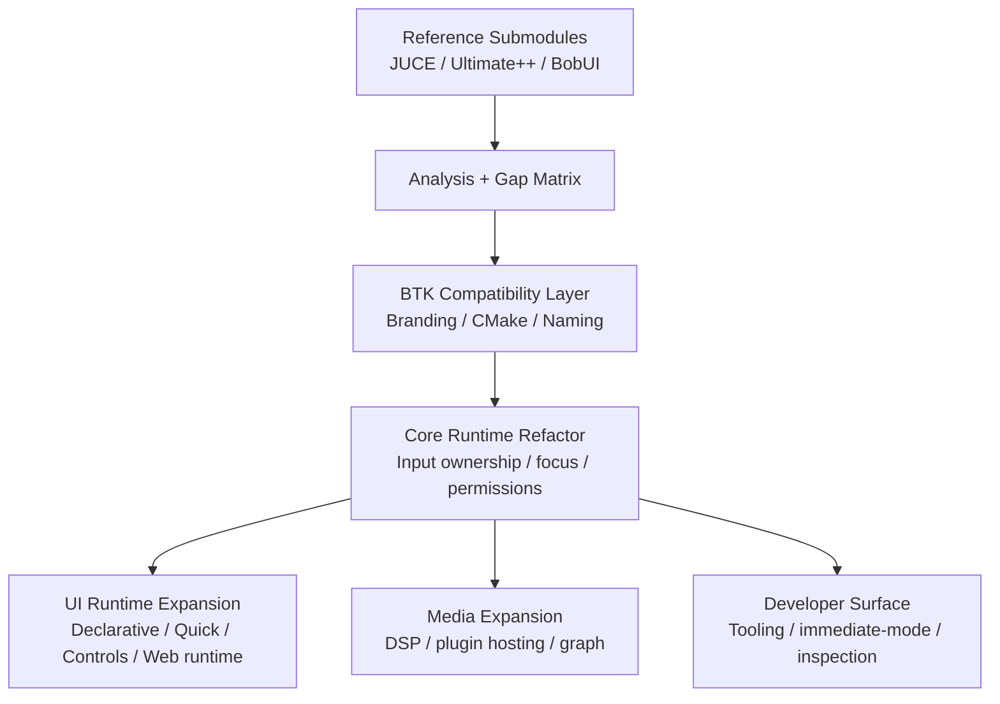
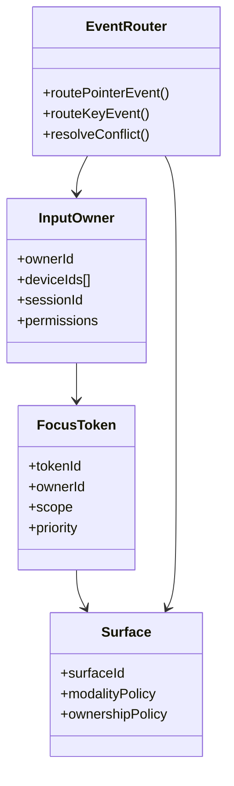

# BTK Ecosystem Assimilation Design

## Design Goal
Create a staged path from the current BTK codebase to a broader framework platform without destabilizing the existing mature C++ foundation.

## High-Level Strategy
1. **Reference Intake**: track BobUI, JUCE, and Ultimate++ as submodules.
2. **Brand Compatibility Layer**: expose BTK-branded CMake/package targets before full symbol migration.
3. **Capability Matrix**: evaluate each external framework by subsystem, not by hype.
4. **Foundational Refactor**: add multi-user ownership/focus/input primitives in BTK core/gui.
5. **Subsystem Assimilation**: implement or port capability workstreams incrementally.

## Architecture Layers

## Comparative Snapshot
| Area | Current BTK | BobUI reference | JUCE | Ultimate++ | Key Direction |
|---|---|---|---|---|---|
| Mature C++ widget/runtime base | Strong | Weak/partial in Go track | Moderate | Strong | Preserve BTK foundation |
| Declarative/Quick runtime | Partial/inactive | Experimental | Weak | Weak | Build modern BTK declarative stack |
| Web runtime | WebKit-era | Compile-safe WebView bridge | Limited | Limited | Add modern WebEngine-style architecture |
| Audio/DSP/plugins | Partial multimedia | Experimental graph/mesh ideas | Excellent | Limited | Assimilate JUCE-grade audio stack |
| RAD widgets/data grids/docking/reporting | Moderate | Experimental | Moderate | Excellent | Assimilate U++ productivity subsystems |
| Multi-user ownership model | Missing | Explicit design focus | Missing | Missing | Make this a BTK differentiator |
| Immediate-mode tooling/debug UI | Missing | Mentioned/inspired | Partial | Limited | Integrate Dear ImGui-style tooling layer |

## BobUI-Specific Findings
### Strengths worth extracting
- Explicit multi-user and collaboration framing.
- Focus on ownership, permissions, undo/history, and synchronization primitives.
- Lightweight WebView bridge contract (`EvalJS`, `PostMessage`, `Request`, handler registration).
- Strong willingness to separate framework vs shell/desktop concerns.

### Weaknesses to avoid copying directly
- Many parity claims are not runtime-verified.
- Large portions of the Go path are baseline or placeholder implementations.
- Significant documentation/code drift exists.
- Some architecture is expansive before being fully operational.

## Multi-User Focus Model

## Naming Migration Design
- **Phase 1**: introduce BTK package names, config files, and alias targets.
- **Phase 2**: add source-compatible `Btk*` aliases for major public types where feasible.
- **Phase 3**: migrate internal file names, macro names, and install layout.
- **Phase 4**: deprecate `CopperSpice`/`Cs*` externally.

This avoids a destructive one-shot rename.
