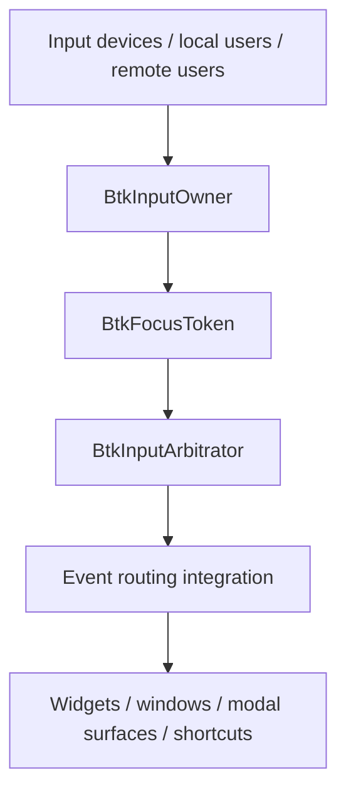

# BTK Multi-User Focus and Ownership Foundation

## Purpose
Define the first concrete BTK-native scaffolding for the user's multi-user operating-system/application model where multiple local and remote users can interact with the same runtime concurrently.

## Problem
Classic Qt-family focus handling assumes a mostly singular notion of:
- active window
- focus widget
- modal blocking scope
- input ownership

That assumption is too narrow for the target BTK paradigm where multiple mice/keyboards/users may act at once.

## Design Principle
BTK should move from **implicit singleton focus** toward **explicit owner-scoped focus tokens**.

## Foundational Types Added
### Core layer
- `BtkInputOwner`
- `BtkFocusToken`

### GUI layer
- `BtkInputArbitrator`
- `BtkInputRouteRequest`
- `BtkInputRouteResult`

## Type Roles
### `BtkInputOwner`
Represents a user/session/device cluster that can own input privileges.

Captured attributes include:
- owner id
- session id
- display name
- device ids
- capabilities/permissions
- local vs remote origin
- collaboration preference
- priority

### `BtkFocusToken`
Represents an explicit grant of focus/interaction authority for a given owner and surface.

Captured attributes include:
- token id
- owner id
- surface id
- scope (`Widget`, `Window`, `Application`, `Workspace`, `Global`)
- modality policy (`Shared`, `OwnerExclusive`, `WindowExclusive`, `ApplicationExclusive`, `SystemExclusive`)
- active state
- priority

### `BtkInputArbitrator`
Provides the first policy surface for deciding whether an incoming request should be:
- shared
- transferred
- queued
- rejected

It currently operates as a small policy object over active focus tokens. It does **not** yet replace the actual event-delivery internals.

## Why this is the right first move
This scaffolding creates a language for the future work without destabilizing the mature runtime immediately.

It allows BTK to evolve in phases:
1. define concepts
2. expose public API
3. test downstream usage
4. integrate with event/focus delivery
5. refactor modal logic
6. expand to remote/network collaboration

## Comparison to BobUI vision
BobUI's strongest idea is that ownership and collaboration should be first-class. BTK now begins to absorb that idea in a more structured C++ form.

## Integration Boundary
### Not yet integrated
- `QApplicationPrivate::focus_widget`
- popup focus stack behavior
- modal window blocking rules
- widget focus chain traversal
- platform-window focus activation

### Planned future integration points
- `QApplicationPrivate::setFocusWidget(...)`
- active window / popup arbitration
- `QGuiApplication` input delivery paths
- shortcut routing and modal suppression rules
- accessibility focus surfaces

### First real integration added
A first narrow GUI integration now exists in `QApplicationPrivate::setFocusWidget(...)`.

It currently works by:
- storing BTK owner/surface context as widget properties (`_btkOwnerId`, `_btkSurfaceId`)
- allowing applications to install focus tokens through `QApplication::setBtkFocusTokens(...)`
- consulting `BtkInputArbitrator` before a focus change is finalized

This is intentionally narrow and low-risk: it does not replace the full focus system, but it creates a real decision point where BTK policy can begin influencing legacy focus behavior.

## Architectural Direction

## Strategic Finding
The existing codebase has deep focus logic already, especially in `qapplication_cs.cpp`. Therefore the correct strategy is **not** a reckless rewrite. The correct strategy is to introduce explicit BTK concepts first and then gradually route legacy focus decisions through them.
